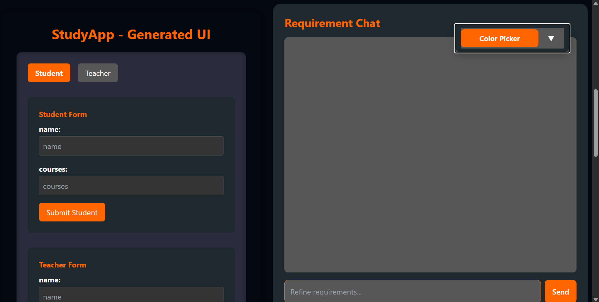
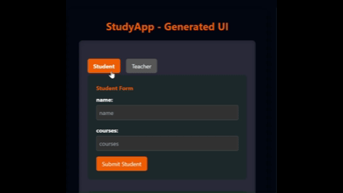
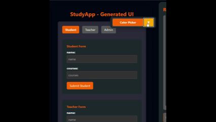
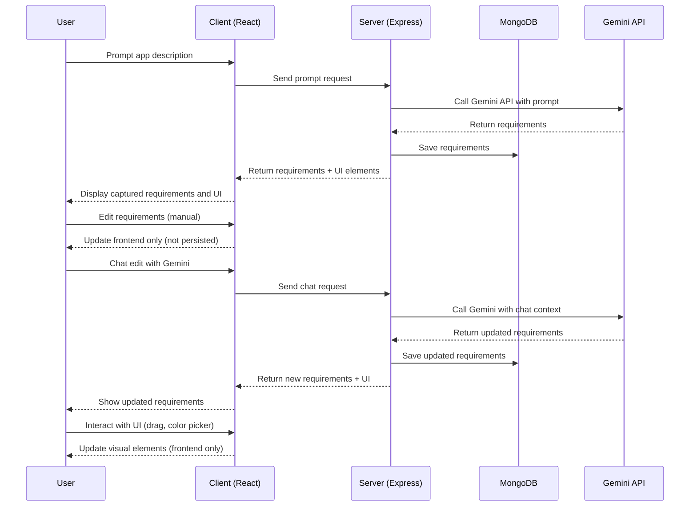

# Generated UI Builder


A dynamic React component that generates, orders, and manages UI elements (e.g., forms, menus) with drag-and-drop support.

This project uses **[@dnd-kit](https://docs.dndkit.com/)** for drag-and-drop functionality, and supports custom component ordering defined by a configuration list.

---

## ✨ Features

* **Dynamic UI generation**: Components are rendered based on configuration (`uiElements`).
* **Custom ordering**: UI elements are sorted according to a predefined `ORDER` list. Unknown components are appended at the end.
* **Drag & drop**: Reorder components interactively using mouse or keyboard.
* **Entity expansion**: Automatically expands `EntitiesForm` for all provided entities.
* **Extensible**: Easily add new components to the `COMPONENT_MAP`.

---

## 📸 Screenshots & Demo

### Default Layout (Auto-Sorted)





### Example GIF Demo





---

## 📦 Installation

```bash
# Clone repository
git clone <your-repo-url>

# Install dependencies
npm install
```

---

## 🚀 Usage

```jsx
import GeneratedUI from "./components/GeneratedUI";

const uiElements = [
  { type: "RolesMenu" },
  { type: "EntitiesForm" },
  { type: "CustomWidget", props: { title: "Extra Widget" } },
];

const entities = [
  { name: "User", fields: [{ name: "email", type: "string" }] },
  { name: "Project", fields: [{ name: "title", type: "string" }] },
];

const roles = ["Admin", "Editor", "Viewer"];

export default function App() {
  return (
    <GeneratedUI
      appName="MyApp"
      uiElements={uiElements}
      entities={entities}
      roles={roles}
      editable={true}
      onUpdateRoles={(updatedRoles) => console.log(updatedRoles)}
      onUpdateEntityFields={(entity, fields) =>
        console.log("Updated", entity, fields)
      }
    />
  );
}
```

---

## 📐 Ordering

The rendering order of components is defined by the `ORDER` list:

```js
const ORDER = [
  "RolesMenu",
  "EntitiesForm",
];
```

* Elements in `ORDER` appear first, in sequence.
* Unknown elements are appended after ordered ones, keeping their relative order.

---

## 🎮 Drag & Drop

* **Mouse**: Click and drag to reorder.

---

## 🛠 Development

```bash
npm run dev
```

Runs the project locally. Open [http://localhost:3000](http://localhost:3000).

---

## 📜 License

MIT License. Free to use and modify.


---

## 🚧 Current Limitations & Future Plans

### Current Limitations

* **Manual edits not persisted**: When requirements are edited manually, they only update the frontend and are not saved to MongoDB.
* **Partial UI generation**: The generated UI is limited to a few components (e.g., `RolesMenu`, `EntitiesForm`).
* **Drag & drop / color picker are frontend-only**: Reordering elements or changing colors does not update the backend yet.
* **Gemini integration is basic**: Currently, only prompts and simple chat-based updates are supported.

### Future Plans

* **Low–Medium Fidelity UI Design Generation**

  * Based on user prompts, automatically generate a low-to-medium fidelity UI mockup.
  * Explore an **open-source UI library** for consistent components.
  * Create a translation function to map Gemini API `uiElements` → actual UI library components.

* **Community-driven UI Marketplace**

  * Build a marketplace where developers/designers can **upload custom UI elements**.
  * When Gemini API suggests a component, recommend relevant UI elements from the community.
  * Allow remixing and sharing of UI elements across projects.

* **Persistence & Collaboration**

  * Save manual requirement edits to MongoDB for consistency.
  * Enable team collaboration: multiple users can refine requirements and UI together in real-time.

* **Advanced UI Customization**

  * Theme editor with color palettes and typography settings.
  * Support for different fidelity levels: **wireframe → prototype → polished UI**.

---

## 🔄 High-Level Flow



---